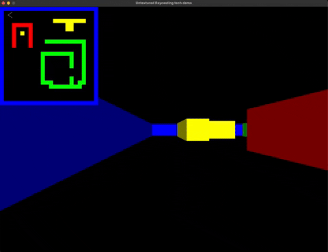
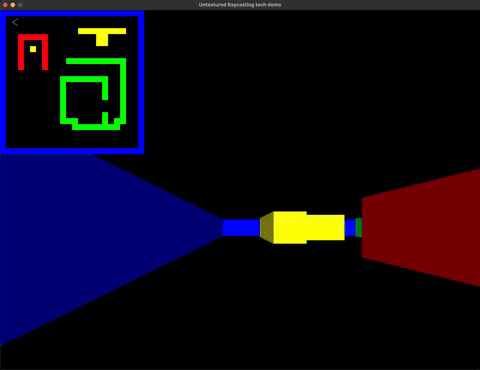
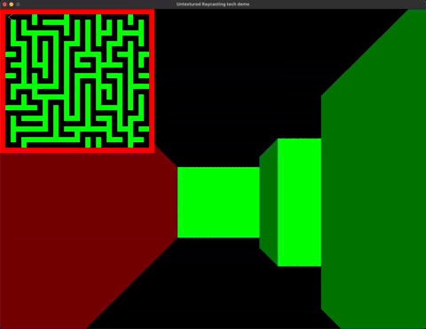

# raycasting-tech-demo
Raycasting tech demo.

Controls:
  - ARROWS to move
  - 'm' to toggle map
  - 'f' to toggle the 'fisheye' view
  - 'w' and 's' to increase/decrease FOV
  - 't' to toggle between textured and untextured raycasting
  - 'g' to generate a maze with hunt and kill algorithm

TODO: sprites, directional sprites, doors, secrets, fog, enemies, ...

Sources:
  - https://permadi.com/1996/05/ray-casting-tutorial-table-of-contents/
  - https://lodev.org/cgtutor/raycasting.html
  - https://github.com/wernsey/lodev-enhance

